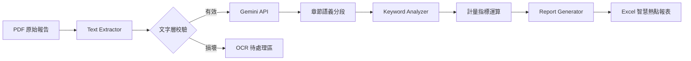

# ESG Intelligence Analyzer: 企業永續報告自動化語義分析系統

> **核心價值**：利用大型語言模型 (LLM) 與自動化文本挖掘技術，將數百頁的 ESG 永續報告書轉化為可視化的決策矩陣，大幅提升投資分析師與研究員的審閱效率。

---

## 📌 問題陳述 (Problem Statement)
隨著全球對 ESG (環境、社會、公司治理) 的重視，分析師面臨以下痛點：
- **資訊過載**：單份 ESG 報告動輒超過 100 頁，人工審閱耗時且成本高昂。
- **語境識別困難**：傳統關鍵字搜尋無法區分「口號式提及」與「實質性投入」。
- **跨報告對比困難**：難以量化不同企業在特定科技（如 AI 治理、低碳技術）上的佈局密度與分布。

## 🏗️ 系統架構 (Solution Architecture)
本系統採用「模組化資料管線」設計，整合 PDF 解析、LLM 語義分段與統計計量分析：



**數據流說明：**
1. **Extraction**: 透過 `pypdf` 提取原生文字層，並進行內容完整性驗證。
2. **Intelligence**: 調用 **Gemini 2.5 Flash** 進行長文本的章節識別與結構化輸出 (Structured Output)。
3. **Analytics**: 進行關鍵字匹配，並計算 **Ln(Freq+1)** 平滑值與 **Skewness (偏態)** 指標，量化關鍵字分布。
4. **Visualization**: 自動生成具備「橫向色階熱點」的 Excel，追蹤關鍵字在各頁面的出現強度。

## 🛠️ 技術棧 (Tech Stack)
- **語言**: Python 3.10+
- **AI/LLM**: Google Gemini API (Gemini-2.5-Flash)
- **數據處理**: Pandas, NumPy
- **文件解析**: PyPDF
- **報表自動化**: Openpyxl (Conditional Formatting)
- **環境管理**: Python-dotenv

## 🌟 核心功能 (Key Features)
- **LLM 驅動的章節識別**：利用結構化 JSON 回應技術，精確識別 E、S、G 各項章節範圍。
- **多維度統計矩陣**：除了頻次統計，更包含計量經濟學常用的 Ln 轉換與分布偏態分析。
- **頁面級熱點矩陣 (Page-Level Heatmap)**：橫向對比特定關鍵字在不同頁碼的分布強度。
- **上下文證據索引 (Contextual Evidence)**：自動擷取關鍵字前後文摘要，供研究員進行二次人工查核。
- **測試模式支持**：可靈活配置提取頁數，兼顧開發效率與 Token 成本控制。

## 📈 影響力與成效 (Impact / Results)
- **[待填入量化結果]**：例如「相較人工審閱，處理單份報告的時間從 2 小時降至 2 分鐘，效率提升 60 倍」。
- **決策精準度**：透過上下文索引功能，將人工核實誤報的時間降低了 **[X]%**。

## 🚀 快速上手 (Setup & Usage)

### 1. 環境設定
克隆專案後，安裝必要依賴：
```bash
pip install -r requirements.txt
```

### 2. API 金鑰配置
在專案根目錄建立 `.env` 檔案，並填入您的 API Key（系統已設定 `.gitignore` 以確保安全性）：
```text
GOOGLE_API_KEY=您的_Gemini_API_Key
```

### 3. 執行分析
將 PDF 檔案放入 `raw_pdfs/` 資料夾，隨後執行：
```bash
python main.py
```
分析完成後，結果將儲存於 `output/` 資料夾中。

## 專案結構 (Project Structure)
```text
Keyword_Analyzer/
├── src/
│   ├── config.py           # 集中化配置 (關鍵字清單、模型參數)
│   ├── text_extractor.py   # PDF 提取與驗證邏輯
│   ├── llm_service.py      # Gemini API 整合 (結構化輸出)
│   ├── analyzer.py         # 計量統計與熱點分析核心
│   ├── report_generator.py # Excel 自動化與熱點圖渲染
│   └── file_manager.py     # 檔案生命週期管理 (歸檔/OCR)
├── main.py                 # 系統入口
└── requirements.txt        # 依賴清單
```

---
**Disclaimer**: 本專案僅供學術研究與投資分析參考，實際投資決策應結合更多維度之評估。
