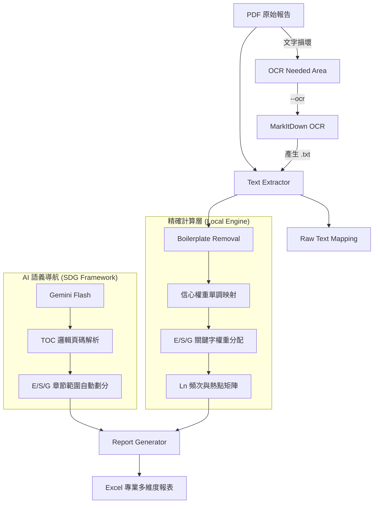

# ESG Intelligence Analyzer: 企業永續報告自動化語義分析系統 (v2.1)

> **核心價值**：結合聯合國 17 項永續發展目標 (SDGs) 語義框架與單調遞增頁碼映射技術，將數百頁的 ESG 永續報告書精確轉化為可視化的決策矩陣與熱點地圖。

---

## 📌 系統優勢 (System Highlights)
本系統針對企業 ESG 報告書中常見的「創意章節命名」與「複雜排版」進行了深度優化：
- **SDGs 語義錨點**：利用聯合國 SDGs 框架指導 LLM (**Gemini Flash**) 進行分類，精確識別如「價值鏈共榮」或「數位賦能」等模糊標題。
- **信心權重頁碼映射 (CWM)**：獨創的頁碼識別演算法，透過「單調遞增鏈」與「雜訊過濾」剔除數據雜訊，確保頁碼定位準確率。
- **雙軌文字處理**：使用原始文字建立物理頁碼映射，並使用過濾文字 (Boilerplate Removed) 進行關鍵字熱點分析。
- **高效能處理架構**：
    - **多進程並發**：支援多核 CPU 並行處理大量 PDF，顯著縮短分析時間。
    - **簡潔日誌模式**：處理 5 個以上檔案時自動切換為「簡潔模式」，僅顯示核心進度與報表生成資訊。
- **智慧 OCR 整合**：整合 **Microsoft MarkItDown**，能自動將掃描件或文字層損壞的 PDF 轉換為高質量的 Markdown/Text 格式進行後續分析。

## 🏗️ 系統架構 (Solution Architecture)


```mermaid
graph TD
    A[PDF 原始報告] --> B[Text Extractor]
    A -->|文字損壞| Z[OCR Needed Area]
    Z -->|--ocr| Y[MarkItDown OCR]
    Y -->|產生 .txt| B
    
    B --> C[Raw Text Mapping]
    B --> D[Boilerplate Removal]
    
    subgraph "AI 語義導航 (SDG Framework)"
        E[Gemini Flash] --> F[TOC 邏輯頁碼解析]
        F --> G[E/S/G 章節範圍自動劃分]
    end
    
    subgraph "精確計算層 (Local Engine)"
        D --> H[信心權重單調映射]
        H --> I[E/S/G 關鍵字權重分配]
        I --> J[Ln 頻次與熱點矩陣]
    end
    
    G --> K[Report Generator]
    J --> K
    
    K --> L[Excel 專業多維度報表]
```

## 🌟 核心功能 (Key Features)
- **SDG 導向的 E/S/G 分類**：
    - **Environmental (E)**: 聚焦 SDG 6, 7, 12, 13, 14, 15 (氣候、減碳、循環經濟)。
    - **Social (S)**: 聚焦 SDG 1-5, 8, 10 (人才、DEI、人權、社會公益)。
    - **Governance (G)**: 聚焦 SDG 9, 11, 16, 17 (創新、資安、合規、供應鏈)。
- **自動化生命週期管理**：處理完成的檔案自動歸檔至 `archive/`。
- **多維度彙總**：支援單一報告分析與跨年度公司彙總報表生成。

## 🛠️ 技術棧 (Tech Stack)
- **LLM**: Google Gemini API (**Gemini-3-Flash-Preview**)
- **OCR**: Microsoft MarkItDown
- **Algorithm**: Monotonic Sequence Mapping (單調序列映射)
- **Data**: Pandas, NumPy, Openpyxl
- **PDF**: PyPDF

## 🚀 快速上手 (Setup & Usage)

### 1. 環境設定
```bash
pip install -r requirements.txt
pip install markitdown
```

### 2. 配置 .env
```text
GOOGLE_API_KEY=您的_API_Key
```

### 3. 執行分析
將 PDF 放入 `raw_pdfs/` 並執行：
```bash
# 標準分析 (含自動識別掃描件)
python main.py

# 執行 OCR 處理 ocr_needed 中的掃描件
python main.py --ocr

# 僅根據現有分析結果重新生成彙總報表
python main.py --summary-only
```

## 📂 專案結構 (Project Structure)
```text
Keyword_Analyzer/
├── src/
│   ├── config.py           # 集中化配置 (關鍵字清單、SDG 定義)
│   ├── text_extractor.py   # CWM 頁碼映射與文字提取
│   ├── llm_service.py      # SDG 導向的 TOC 解析與 Token 監控
│   ├── ocr_service.py      # Microsoft MarkItDown OCR 服務
│   ├── analyzer.py         # 互斥性統計、指標運算
│   ├── report_generator.py # Excel 色階熱點圖與彙總報表
│   └── file_manager.py     # 檔案歸檔與 OCR 分流管理
├── main.py                 # 多進程分析管線調度器
└── requirements.txt        # 依賴清單
```

---
**Disclaimer**: 本專案生成的報表僅供投資分析參考，實際決策應結合企業原始揭露資訊進行核實。